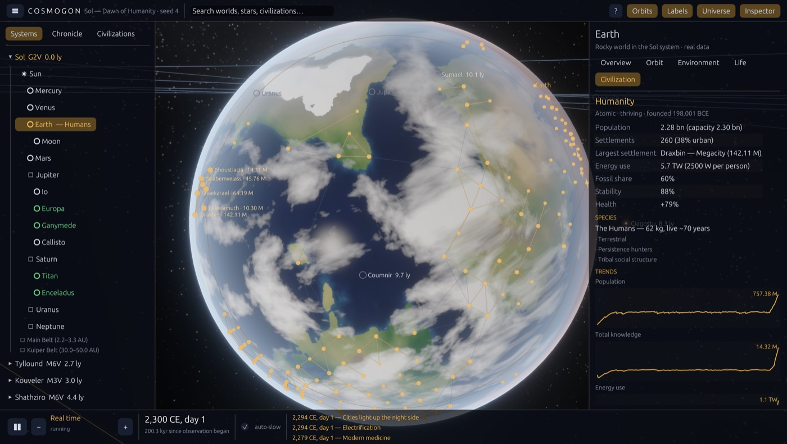

# Architecture



## Principle
**The simulation is authoritative and engine-independent. The application is a view.**

```
┌──────────────────────────── crates/cosmogon (Bevy app) ────────────────────────────┐
│  sim.rs        sessions (sandbox / read-only reference), create/load on task pool, │
│                advance under CPU budget, edits with undo/redo, predictions, saves  │
│  persistence   sandbox folders: manifest, state, autosave, checkpoints, thumbnail  │
│  camera.rs     f64 orbit/zoom/track rig → defines the floating origin each frame    │
│  render/       f64 WorldPos → camera-relative Transforms; planet & atmosphere WGSL; │
│                textures baked from the sim's own terrain; lights from settlements   │
│  ui/           egui: home, HUD, tools (create, launch, physics, palette), editable  │
│                inspector with units & provenance, civilization dashboard, markers   │
│  capture.rs    GPU screenshots for verification                                     │
└───────────────────────────────▲──────────────────────────────────────────────────────┘
                                │  reads state, issues commands (never edits the model)
┌───────────────────────────────┴──────── crates/cosmogon_sim (no engine deps) ───────┐
│  universe.rs   owns all state; advance_to(t, budget, stop_on_milestone)              │
│  scheduler.rs  fixed-period tasks: biospheres every 10 kyr, civilizations every year │
│  astro/        stars, Kepler orbits, dynamics (N-body state per system), objects &  │
│                provenance, JPL Horizons dataset, procedural systems, real Sol        │
│  sandbox.rs    Edit commands → validate, apply, journal, propagate consequences     │
│  impact.rs     impact energy, crater, blast, winter, extinction scaling             │
│  planet/       climate, terrain (shared with renderer), resources & deposits         │
│  habitability, life, civ/ (species, knowledge, tech graph, settlements), history     │
│  save.rs       versioned JSON with migrations          rng.rs  keyed RNG streams     │
│  data/         science.toml · technologies.toml · sol.toml   (embedded, data-driven) │
└───────────────────────────────▲──────────────────────────────────────────────────────┘
                 ┌──────────────┴──────────────┐
          cosmogon_physics               cosmogon_core           cosmogon_cli (headless)
          Kepler, elements,              f64 math, units,        run · check · survey
          integrators, gravity           constants
```

## Crates
| Crate | Responsibility | Depends on |
|---|---|---|
| `cosmogon_core` | f64 vectors, constants, units | — |
| `cosmogon_physics` | orbital mechanics, N-body integrator, collisions | core |
| `cosmogon_sim` | the universe model (everything that isn't pixels) | core, physics, serde, toml |
| `cosmogon_cli` | headless runs, determinism checks, surveys | sim |
| `cosmogon` | the desktop app | sim, Bevy 0.18, bevy_egui |

The brief's suggested modules map onto `cosmogon_sim` as: Astronomy → `astro`, Planet/Climate → `planet`,
Life → `life`, Civilization/Technology/Economy → `civ`, History → `history`, Simulation (time,
scheduler) → `time`, `scheduler`, `universe`, Persistence → `save`, Core → `rng`, `noise`, `params`.
Rendering/UI/Platform live in the app crate.

## Frame
```
Update:  Frame::Simulate  → advance universe (≤ 9 ms CPU budget)
         Frame::Positions → f64 world positions & rotations from the universe
         Frame::Camera    → camera rig; sets ViewInfo.origin = camera f64 position
         Frame::Apply     → Transform = world − origin; materials; texture LOD; lights; gizmos
EguiPrimaryContextPass:     markers, panels, toasts
```

## Sandbox edits and the consequence pipeline
The UI never mutates the model: it sends `cosmogon_sim::sandbox::Edit` commands through
`Sim::edit` (which keeps an undo snapshot). `Universe::apply_edit` validates, activates N-body
for the system, syncs the integrator exactly to the current time, applies, re-grids the step,
journals the edit and propagates it. Physics emits collisions (`ContactEvent`) and the
environment task notices insolation changes; `sandbox.rs` carries both down the chain:
orbit → insolation → climate → habitability → biosphere → civilization (see docs/SANDBOX_VISION.md).

## Ownership and concurrency
All simulation state lives in one `Universe` value owned by the `Sim` resource. Universe creation
and loading run on Bevy's async task pool; prehistory is parallelised internally with scoped threads
(biospheres are independent and draw from their own RNG streams, so results are deterministic).
Texture baking runs on the task pool from cloned body data. Moving `advance` itself to a worker
thread is planned (Phase 1 follow-up); the API was shaped for it (`advance_to` + budget).

## Determinism
See [SIMULATION.md](SIMULATION.md#determinism). Enforced by tests and by `cosmogon-cli check` in CI.

## Data-driven content
`science.toml` (rates and assumptions), `technologies.toml` (the technology graph) and `sol.toml`
(the real Solar System) are embedded in the binary — the app needs no files beside itself — and
validated at load (unknown references and dependency cycles are rejected by tests).
