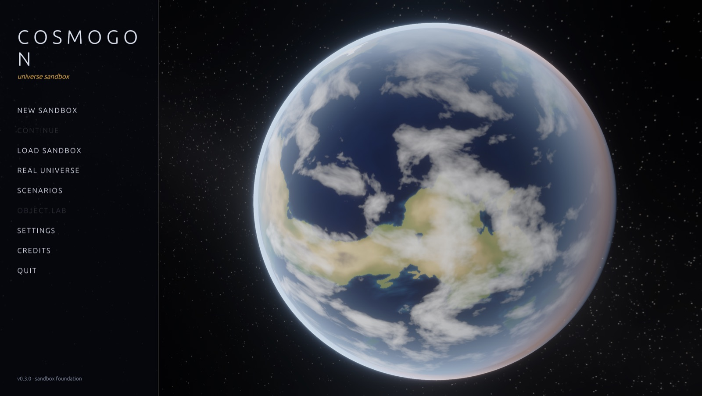
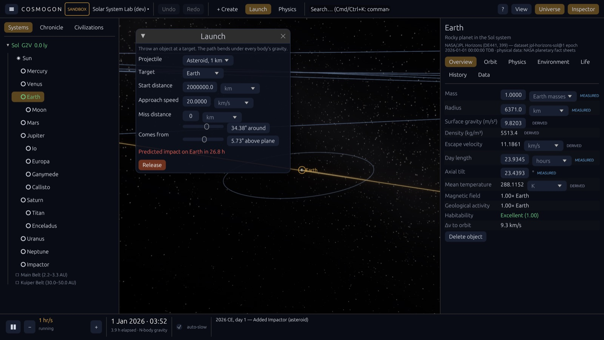
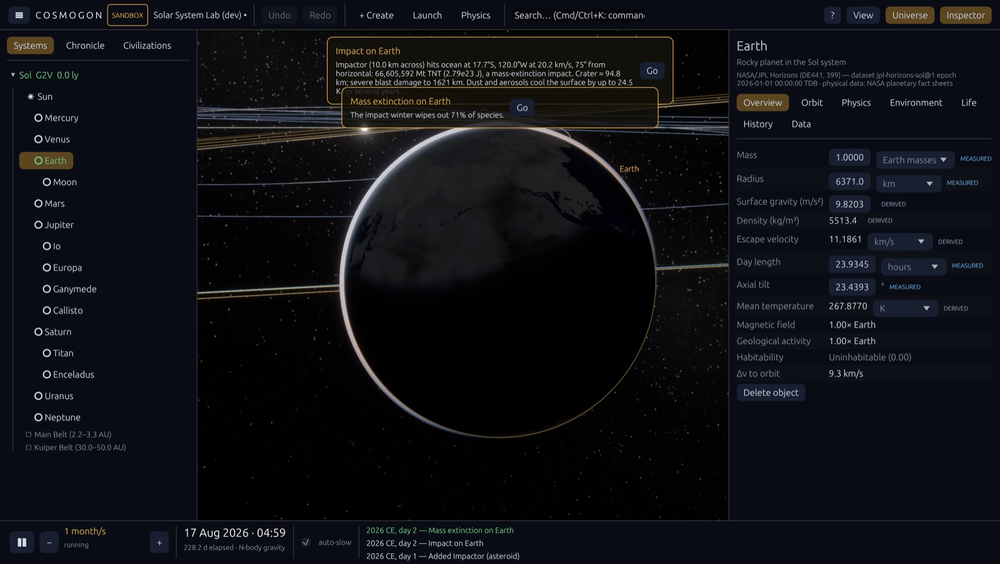
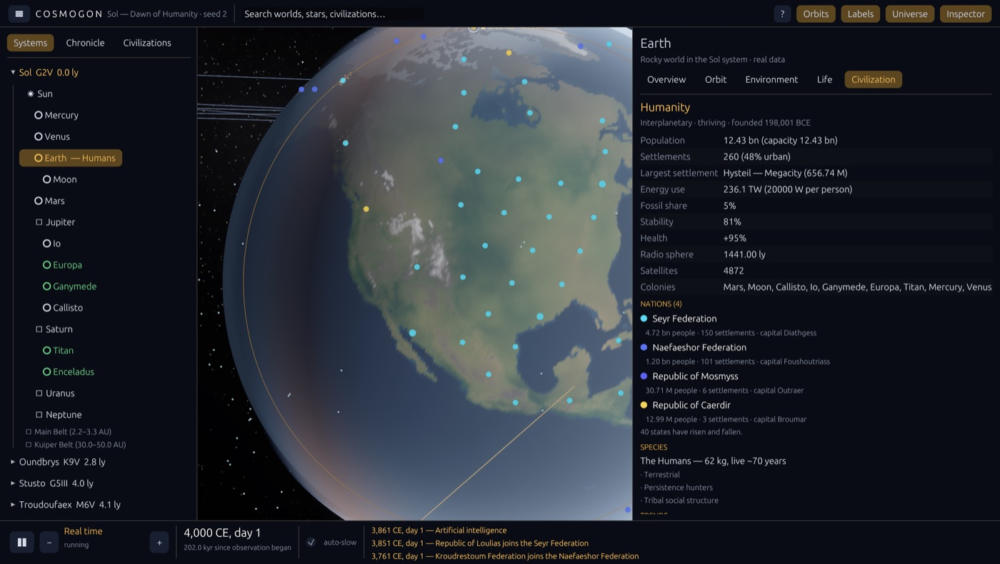
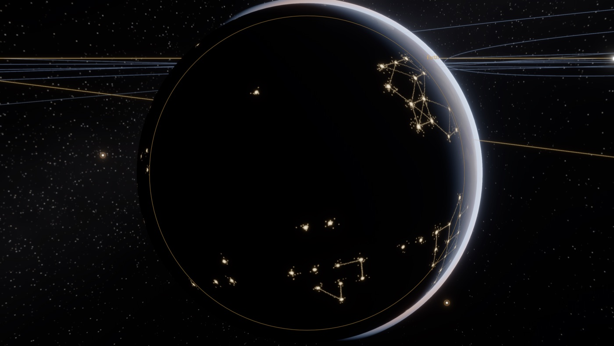
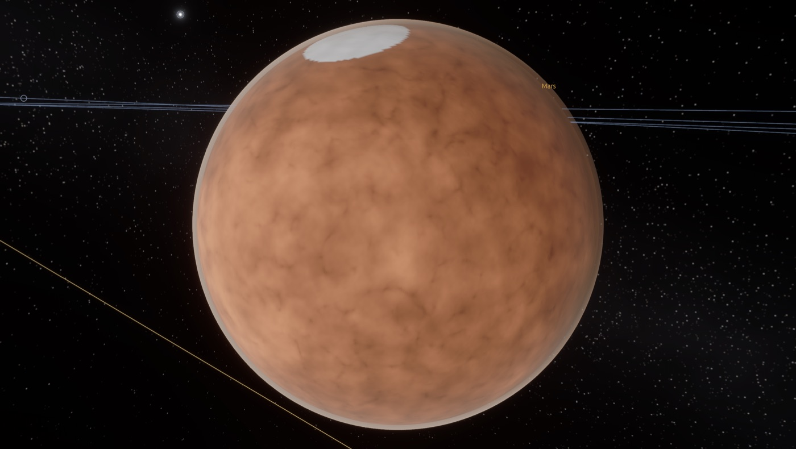
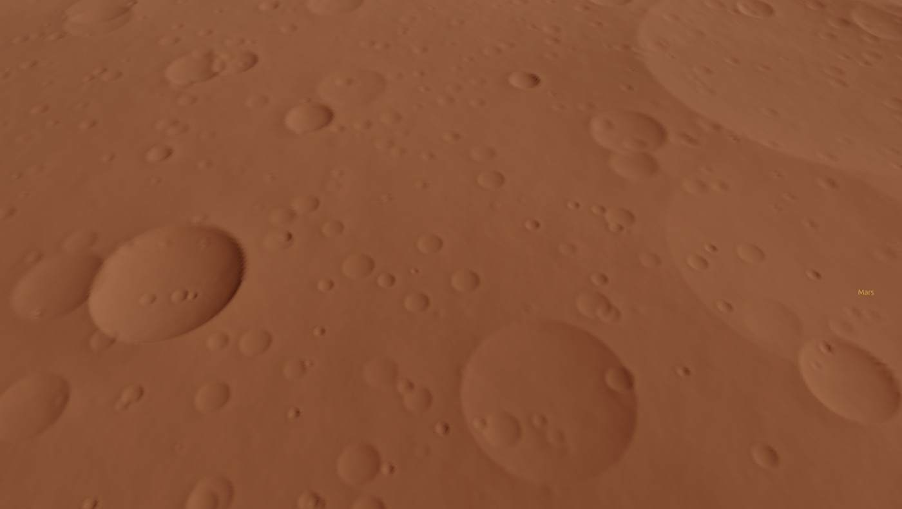

# Cosmogon

**A universe sandbox that remembers.** Start from the real Solar System (NASA/JPL data), add planets,
throw asteroids, change the Sun — and watch the consequences run through orbits, climate, life and
civilizations. Worlds can develop life and, sometimes, civilizations that discover technology through
causes, not timers.

| Launching an asteroid at Earth — the predicted path bends under gravity | The impact: energy, crater, winter, extinction |
|---|---|
|  |  |

| Rival nations on the real Earth, 4000 CE | The night side of an industrial world |
|---|---|
|  |  |
| **Mars** | **Close-up terrain: a crater field on Mars** |
|  |  |

## Download
Get the latest **macOS `.dmg`** or **Windows `.exe`** from
[GitHub Releases](https://github.com/ashvyagni/SpaceRender/releases). Nothing else needs to be installed.
The builds are unsigned, so the first launch needs one extra click — see the release notes.

## Try it
* **macOS:** open `dist/Cosmogon-<version>-macOS.dmg`, drag Cosmogon to Applications, double-click.
  (Unsigned builds: right-click → *Open* the first time.) To build it yourself: `scripts/package-macos.sh`.
* **Windows / Linux:** push a `v*` tag; [`.github/workflows/release.yml`](.github/workflows/release.yml) builds a
  Windows installer and portable `.exe`, a universal macOS DMG and a Linux tarball.
* **From source:** `cargo run --release -p cosmogon` (see [BUILDING.md](BUILDING.md)).

**NEW SANDBOX** offers seven templates: the **Solar System Lab** (today's Solar System from JPL Horizons, with
N-body gravity), **Dawn of Humanity** (the real Solar System 200,000 years ago, with early humans), a
**habitable world**, a **procedural star system**, a **stellar neighbourhood**, an **empty system** to build
yourself, and **custom**. **SCENARIOS** has ready-made experiments (no Moon, 2× Jupiter, a brighter Sun,
Chicxulub today, a rogue planet, two moons, Mars with Earth's air). **REAL UNIVERSE** shows the real data
read-only; clone it to experiment. Time runs from real time to 100 million years per second.

## The sandbox
* **+ Create** a planet, moon, giant, dwarf planet, asteroid or comet: choose mass, radius, where it orbits and how fast.
* **Launch** an object at any body: the predicted trajectory and any impact are shown before you release it.
* **Edit anything** in the inspector — mass, radius, gravity, day length, tilt, orbit, atmosphere, water, the star's
  mass and age — in the units you like (typed values accept scientific notation). Every change is undoable.
* **Physics**: switch between fixed (Kepler) orbits and dynamic N-body gravity; choose Fast, Balanced, Accurate or
  Research. Collisions merge bodies; impacts leave craters, cause impact winters and extinctions.
* **Consequences**: change an orbit or the Sun and the climate, habitability and civilizations respond; the
  chronicle reports what happened and why.
* **Honest data**: every value is labelled MEASURED, DERIVED, ESTIMATED, PROCEDURAL or USER MODIFIED.
* Sandboxes save to their own folders with autosave, checkpoints, duplicates and thumbnails; **Continue** resumes.

## What's simulated
Stars that brighten and die · Keplerian orbits exact at any time scale · procedural systems with statistically
plausible stars, planets, moons, belts and rings · climate with greenhouse, carbon cycle and ice ages ·
habitability as a breakdown of factors · life from prebiotic chemistry to intelligence, with oxygenation, fossil-fuel
formation and mass extinctions · civilizations with population, 13 knowledge domains, pressures, crises and collapse ·
a 56-technology causal graph with alternative routes and resource/environment gates · settlements, roads, rail and
sea lanes · satellites, colonies, probes and radio signals that other civilizations can detect · deterministic,
versioned saves.

Ask any civilization *why*: every discovery records its route and drivers, and the inspector explains what is still
missing for the next ones ("Bronze working — needs tin ≥ 0.15× Earth").

## Controls
Drag to orbit · scroll (or W/S) to zoom from metres to light-years · click to select · double-click or **F** to fly
there · **Home** for the whole system · **Space** pause · **, .** speed · **⌘/Ctrl+K** command palette ·
**⌘/Ctrl+Z / Shift+Z** undo / redo · **⌘/Ctrl+S** save · **Tab** hide UI · **F3** developer overlay · **F1** help ·
**Esc** menu.

## Documentation
[Sandbox vision](docs/SANDBOX_VISION.md) · [Milestone S1 status](docs/MILESTONE_S1.md) ·
[Physics engine](docs/PHYSICS_ENGINE.md) · [Data sources](docs/DATA_SOURCES.md) · [Object model](docs/OBJECT_MODEL.md) ·
[Save format](docs/SAVE_FORMAT.md) · [UI system](docs/UI_SYSTEM.md) · [Gap analysis](docs/GAP_ANALYSIS.md) ·
[ARCHITECTURE](ARCHITECTURE.md) · [ROADMAP](ROADMAP.md) · [SIMULATION](SIMULATION.md) ·
[CIVILIZATION_MODEL](CIVILIZATION_MODEL.md) · [TECHNOLOGY_MODEL](TECHNOLOGY_MODEL.md) · [RENDERING](RENDERING.md) ·
[BUILDING](BUILDING.md) · [CHANGELOG](CHANGELOG.md) · [prototype audit](docs/AUDIT.md) ·
[engine assessment](docs/ENGINE_ASSESSMENT.md) · [assets & licensing](ASSETS.md)

## License
MIT OR Apache-2.0.
