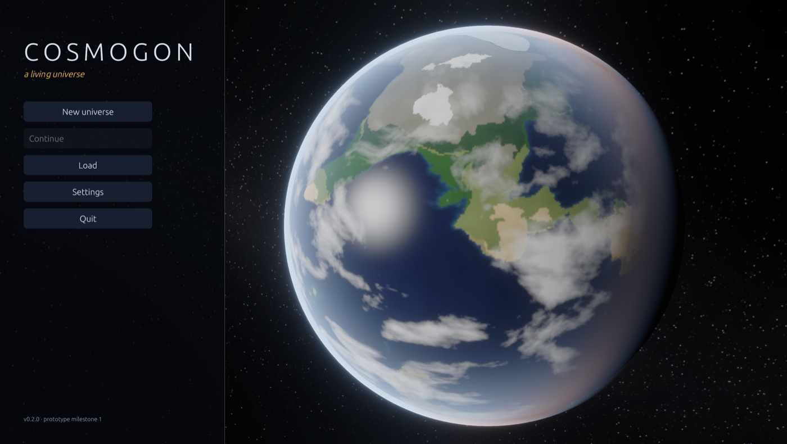

# Cosmogon

**A living universe.** A physically grounded space simulator in which potentially habitable worlds can
develop life and, sometimes, civilizations. Those civilizations discover technology through causes, not
timers, and change their planets in ways you can see from orbit.

| Rival nations on the real Earth, 4000 CE | The night side of an industrial world |
|---|---|
|  |  |
| **Mars** | **Close-up terrain: a crater field on Mars** |
|  |  |

## Download
Get the latest **macOS `.dmg`** or **Windows `.exe`** from
[GitHub Releases](https://github.com/ashvyagni/SpaceRender/releases). Nothing else needs to be installed.
The builds are unsigned, so the first launch needs one extra click — see the release notes.

## Try it
* **macOS:** open `dist/Cosmogon-<version>-macOS.dmg`, drag Cosmogon to Applications, double-click.
  (Unsigned builds: right-click → *Open* the first time.) To build it yourself: `scripts/package-macos.sh`.
* **Windows / Linux:** push a `v*` tag; [`.github/workflows/release.yml`](.github/workflows/release.yml) builds a
  Windows installer and portable `.exe`, a universal macOS DMG and a Linux tarball.
* **From source:** `cargo run --release -p cosmogon` (see [BUILDING.md](BUILDING.md)).

Three scenarios: a realistic **stellar neighbourhood** (often lifeless — that's the point), a **garden world**
rich in complex life, and **Sol — Dawn of Humanity**, the real Solar System 200,000 years ago. Pick a speed from
real time to 100 million years per second; the simulation slows down by itself for milestones.

## What's simulated
Stars that brighten and die · Keplerian orbits exact at any time scale · procedural systems with statistically
plausible stars, planets, moons, belts and rings · climate with greenhouse, carbon cycle and ice ages ·
habitability as a breakdown of factors · life from prebiotic chemistry to intelligence, with oxygenation, fossil-fuel
formation and mass extinctions · civilizations with population, 13 knowledge domains, pressures, crises and collapse ·
a 56-technology causal graph with alternative routes and resource/environment gates · settlements, roads, rail and
sea lanes · satellites, colonies, probes and radio signals that other civilizations can detect · deterministic,
versioned saves.

Ask any civilization *why*: every discovery records its route and drivers, and the inspector explains what is still
missing for the next ones ("Bronze working — needs tin ≥ 0.15× Earth").

## Controls
Drag to orbit · scroll (or W/S) to zoom from metres to light-years · click to select · double-click or **F** to fly
there · **Home** for the whole system · **Space** pause · **, .** speed · **Tab** hide UI · **⌘/Ctrl+S** quick save ·
**F3** developer overlay · **F1** help · **Esc** menu.

## Documentation
[ARCHITECTURE](ARCHITECTURE.md) · [ROADMAP](ROADMAP.md) · [SIMULATION](SIMULATION.md) ·
[CIVILIZATION_MODEL](CIVILIZATION_MODEL.md) · [TECHNOLOGY_MODEL](TECHNOLOGY_MODEL.md) · [RENDERING](RENDERING.md) ·
[BUILDING](BUILDING.md) · [CHANGELOG](CHANGELOG.md) · [prototype audit](docs/AUDIT.md) ·
[engine assessment](docs/ENGINE_ASSESSMENT.md) · [assets & licensing](ASSETS.md)

## License
MIT OR Apache-2.0.
