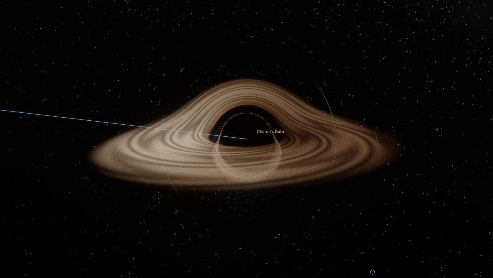
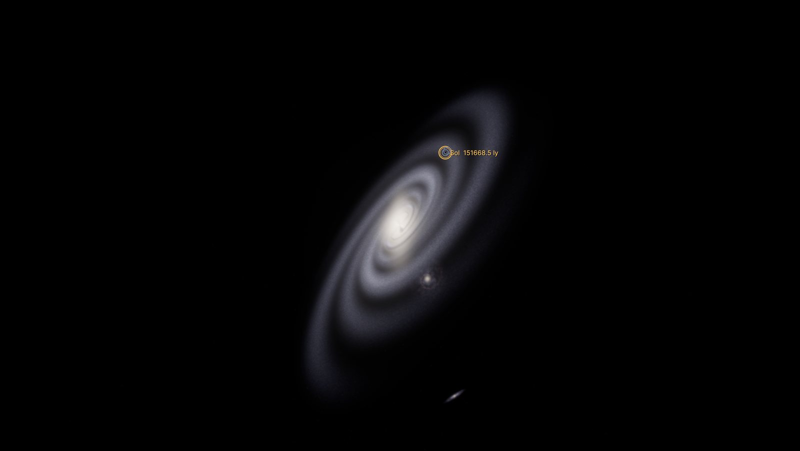
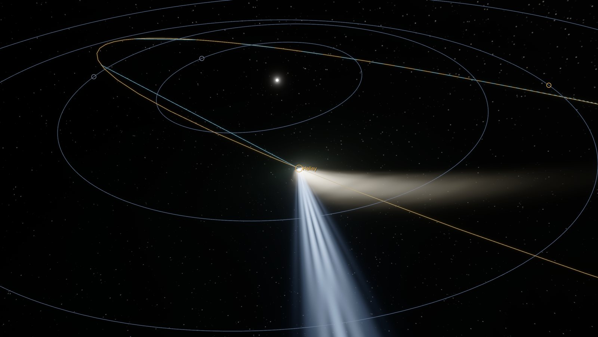
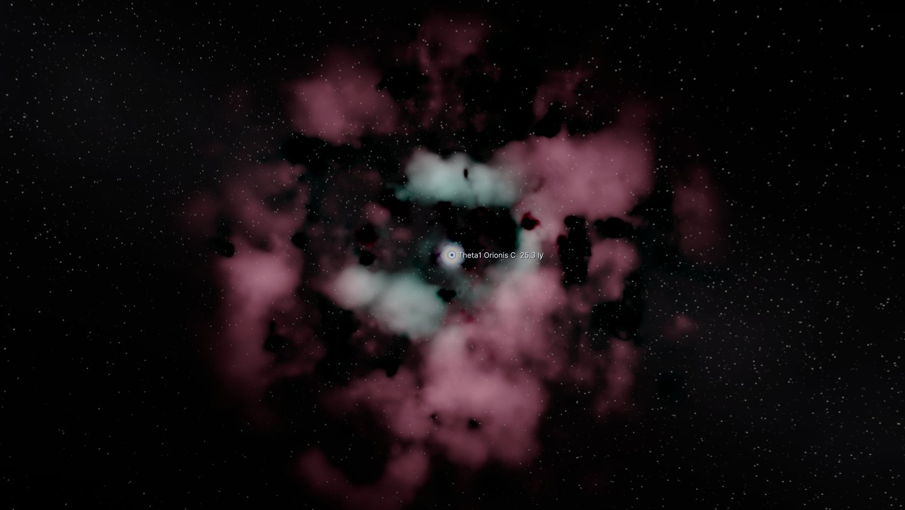
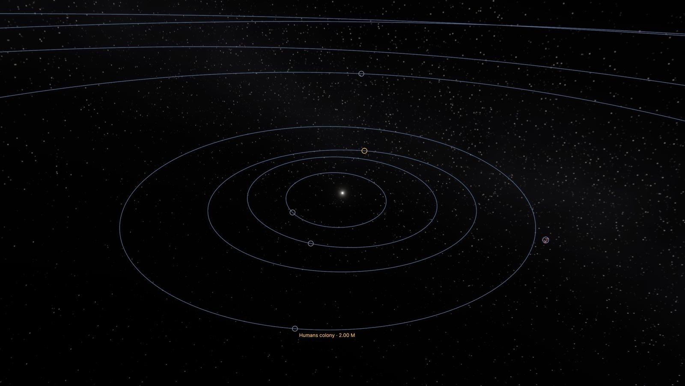
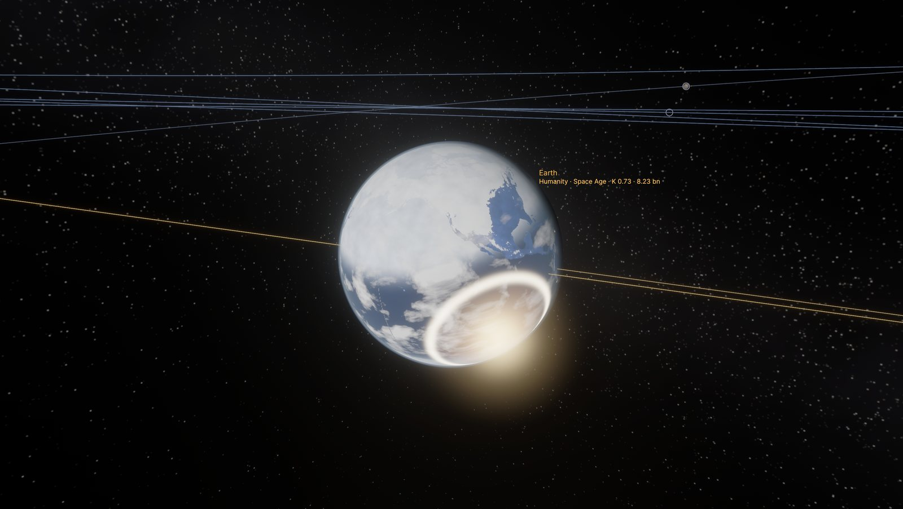
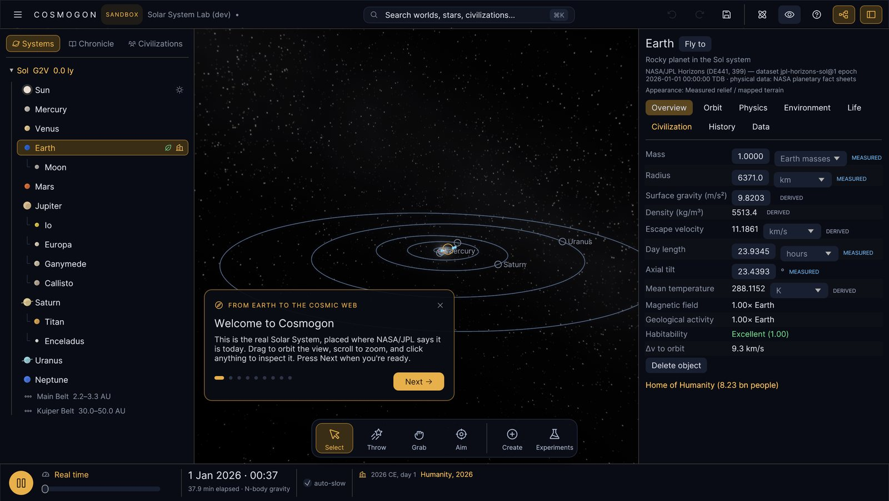

# Cosmogon

**A free universe sandbox that remembers.** Throw planets and black holes, watch stars live and die, pull
back from a city street to the cosmic web — and see what happens to the people. Start from the real Solar
System (NASA/JPL data); every change runs through orbits, climate, life and civilizations that discover
technology through causes, not timers.

| A feeding black hole: ray-traced lensing and a Doppler-beamed disk | The Milky Way from 150,000 light-years |
|---|---|
|  |  |
| **Halley's Comet: ion and dust tails** | **The Orion Nebula, where stars are born** |
|  |  |
| **A Dyson swarm around the Sun** | **An asteroid strike: fireball and shock ring** |
|  |  |
| **Guided tours for a first look** | **Rival nations on the real Earth, 4000 CE** |
|  |  |

## Download
Get the latest **macOS `.dmg`** or **Windows `.exe`** from
[GitHub Releases](https://github.com/ashvyagni/SpaceRender/releases). Nothing else needs to be installed.
The builds are unsigned, so the first launch needs one extra click — see the release notes.

## Try it
* **macOS:** open `dist/Cosmogon-<version>-macOS.dmg`, drag Cosmogon to Applications, double-click.
  (Unsigned builds: right-click → *Open* the first time.) To build it yourself: `scripts/package-macos.sh`.
* **Windows / Linux:** push a `v*` tag; [`.github/workflows/release.yml`](.github/workflows/release.yml) builds a
  Windows installer and portable `.exe`, a universal macOS DMG and a Linux tarball.
* **From source:** `cargo run --release -p cosmogon` (see [BUILDING.md](BUILDING.md)).

**NEW SANDBOX** offers seven templates: the **Solar System Lab** (today's Solar System from JPL Horizons, with
N-body gravity), **Dawn of Humanity** (the real Solar System 200,000 years ago, with early humans), a
**habitable world**, a **procedural star system**, a **stellar neighbourhood**, an **empty system** to build
yourself, and **custom**. **SCENARIOS** has four **guided tours** and ready-made experiments (no Moon, 2× Jupiter,
Chicxulub today, Theia, a black hole flyby, a second sun, the Sun as a red giant or a dying supergiant,
Halley's Comet, a Kardashev II humanity and more). **REAL UNIVERSE** shows the real data
read-only; clone it to experiment. Time runs from real time to 100 million years per second.

## The sandbox
* **+ Create** a planet, moon, giant, dwarf planet, asteroid or comet: choose mass, radius, where it orbits and how fast.
* **Launch** an object at any body: the predicted trajectory and any impact are shown before you release it.
* **Edit anything** in the inspector — mass, radius, gravity, day length, tilt, orbit, atmosphere, water, the star's
  mass and age — in the units you like (typed values accept scientific notation). Every change is undoable.
* **Physics**: switch between fixed (Kepler) orbits and dynamic N-body gravity; choose Fast, Balanced, Accurate or
  Research. Collisions merge bodies; impacts leave craters, cause impact winters and extinctions.
* **Consequences**: change an orbit or the Sun and the climate, habitability and civilizations respond; the
  chronicle reports what happened and why.
* **Honest data**: every value is labelled MEASURED, DERIVED, ESTIMATED, PROCEDURAL or USER MODIFIED.
* Sandboxes save to their own folders with autosave, checkpoints, duplicates and thumbnails; **Continue** resumes.
* **Interfere** in a civilization — inspire it, send a signal, share knowledge, teach a technology it is ready
  for, or test it with hardship — once every 25 years, never skipping what its own history must earn.

## The whole universe (new in 1.0)
* **Throw anything**: the Throw tool flings planets, comets, stars and black holes from the shelf (drag;
  click for a circular orbit) with a live trajectory; Grab moves them.
* **Collisions that shatter worlds**: disruption scaling after Leinhardt & Stewart (2012), debris, molten
  surfaces and boiling oceans, impact flashes and shock rings; moons inside the Roche limit become rings.
* **Stars live and die**: red giants swallow planets; planetary nebulae and white dwarfs; supernovae leave
  neutron stars and black holes, and their radiation crosses the galaxy at light speed.
* **Star formation** in nurseries like the real Orion Nebula; **black holes** with gravitational lensing;
  **pulsars**; **comets** with tails.
* **Galaxy scale**: the Milky Way from outside, the Local Group, and thousands of galaxies and quasars.
* **Civilizations beyond their world**: Dyson swarms, terraforming, generation ships founding new branches.
* **Guided tours**, a **timeline you can rewind**, **photo mode** (P) and a synthesised **soundtrack**.

## Worlds and civilizations you can see
* Every world has its own look, chosen from physics or spacecraft imagery: Io's volcanoes, Europa's cracked ice,
  Jupiter's belts and Great Red Spot, Saturn's hexagon and measured rings, Titan's haze, Venus's clouds — and
  exoplanets from lava worlds and mini-Neptunes to Sudarsky-class giants and glowing hot Jupiters.
* Atmospheric scattering, eclipses (moons' shadows), ring shadows, living stellar surfaces.
* The Solar System Lab starts with **humanity in 2026**: real cities and countries, 11 000 satellites, the real
  exploration record and missions in flight (BepiColombo, Europa Clipper, JUICE).
* Civilizations show their era, Kardashev rating and next breakthroughs; their satellites, stations, spacecraft
  and colonies are visible in space, their cities and farmland on the ground.

## What's simulated
Stars that brighten and die · Keplerian orbits exact at any time scale · procedural systems with statistically
plausible stars, planets, moons, belts and rings · climate with greenhouse, carbon cycle and ice ages ·
habitability as a breakdown of factors · life from prebiotic chemistry to intelligence, with oxygenation, fossil-fuel
formation and mass extinctions · civilizations with population, 13 knowledge domains, pressures, crises and collapse ·
a 59-technology causal graph with alternative routes and resource/environment gates · settlements, roads, rail and
sea lanes · satellites, colonies, probes and radio signals that other civilizations can detect · deterministic,
versioned saves.

Ask any civilization *why*: every discovery records its route and drivers, and the inspector explains what is still
missing for the next ones ("Bronze working — needs tin ≥ 0.15× Earth").

## Controls
Drag to orbit · scroll (or W/S) to zoom from metres to light-years · click to select · double-click or **F** to fly
there · **Home** for the whole system · **Space** pause · **, .** speed · **⌘/Ctrl+K** command palette ·
**⌘/Ctrl+Z / Shift+Z** undo / redo · **⌘/Ctrl+S** save · **Tab** hide UI · **P** photo · **F3** developer overlay · **F1** help ·
**Esc** menu.

## Documentation
[HANDOFF (start here to contribute)](HANDOFF.md) · [1.0 product plan](docs/PRODUCT_PLAN_1_0.md) · [Sandbox vision](docs/SANDBOX_VISION.md) · [Milestone S1 status](docs/MILESTONE_S1.md) · [G1 + C1](docs/MILESTONE_G1_C1.md) ·
[Physics engine](docs/PHYSICS_ENGINE.md) · [Data sources](docs/DATA_SOURCES.md) · [Object model](docs/OBJECT_MODEL.md) ·
[Save format](docs/SAVE_FORMAT.md) · [UI system](docs/UI_SYSTEM.md) · [Gap analysis](docs/GAP_ANALYSIS.md) ·
[ARCHITECTURE](ARCHITECTURE.md) · [ROADMAP](ROADMAP.md) · [SIMULATION](SIMULATION.md) ·
[CIVILIZATION_MODEL](CIVILIZATION_MODEL.md) · [TECHNOLOGY_MODEL](TECHNOLOGY_MODEL.md) · [RENDERING](RENDERING.md) ·
[BUILDING](BUILDING.md) · [CHANGELOG](CHANGELOG.md) · [prototype audit](docs/AUDIT.md) ·
[engine assessment](docs/ENGINE_ASSESSMENT.md) · [assets & licensing](ASSETS.md)

## License
MIT OR Apache-2.0.
