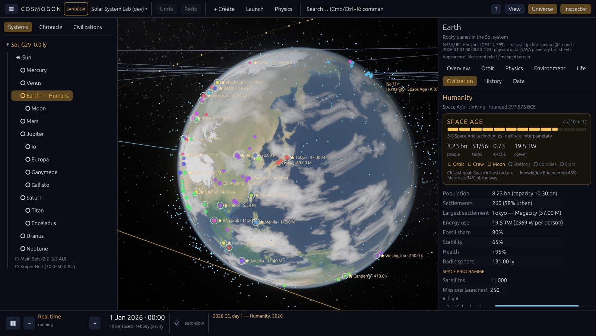
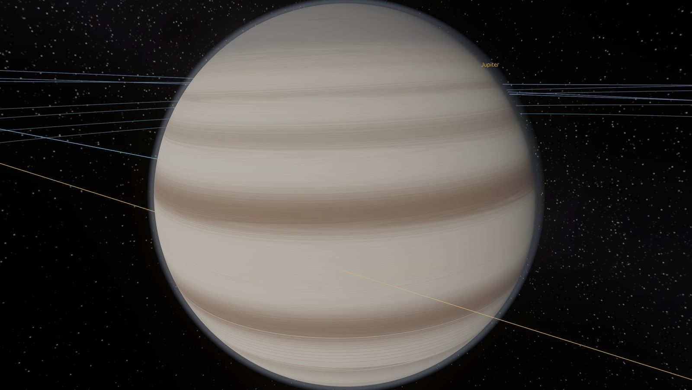
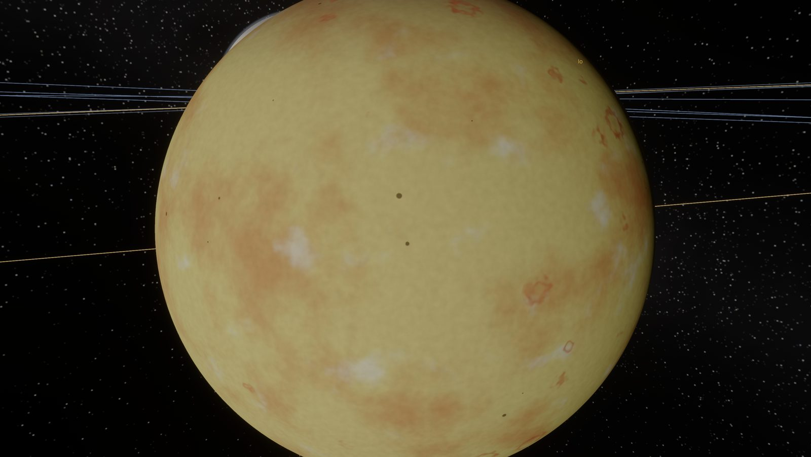
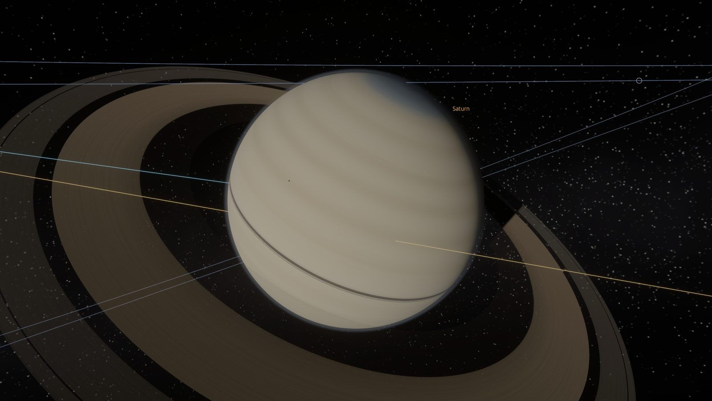
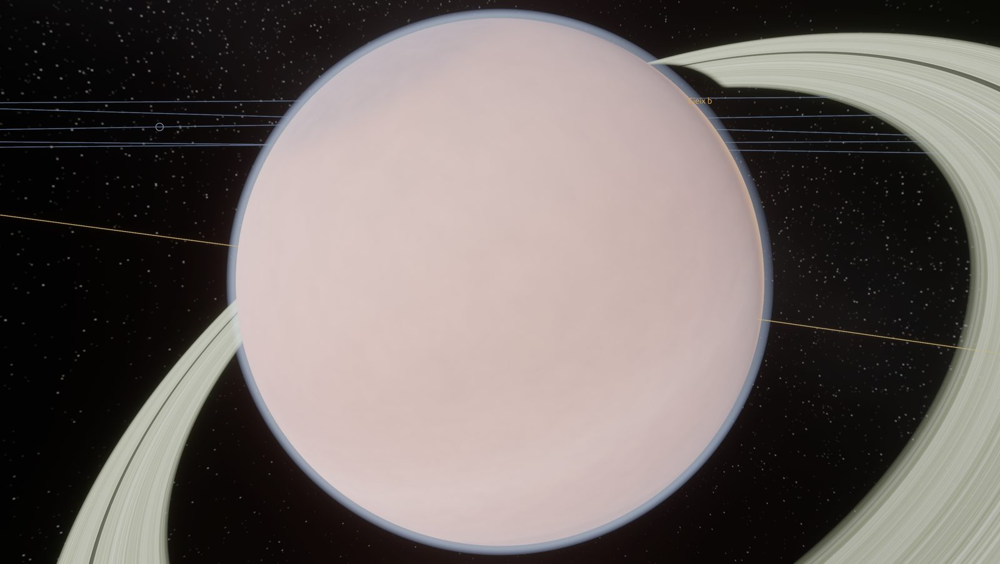

# Milestones G1 + C1 — Worlds worth zooming into, civilizations you can see

| | |
|---|---|
|  |  |
|  |  |

Version 0.5.0. G1 is the graphics upgrade; C1 makes civilizations visible and lets the
user intervene within limits.

## G1 — Graphics

### Appearance model (`crates/cosmogon/src/render/look.rs`)
Every body gets a **look** chosen from its physical state, or, for real worlds, from
spacecraft imagery. The same look colours the baked globe texture, the close-up terrain and
the shader's fine detail, so a world is consistent from orbit to the ground. The inspector
shows it as *Appearance*.

| Style | Real examples | Procedural trigger |
|---|---|---|
| Terrain & climate model | Earth, Moon, Mars | temperate / living / dusty rocky worlds |
| Cratered (maria, ejecta, ray systems) | Mercury, Callisto | airless rocky or icy bodies |
| Volcanic (sulphur plains, paterae, plume rings, glowing lava) | Io | tidally heated airless rocky moons |
| Ice shell (lineae with double ridges, chaos terrain) | Europa | icy bodies with a subsurface ocean |
| Grooved ice (dark ancient terrain, bright grooved lanes) | Ganymede | geologically active ice |
| Tiger stripes | Enceladus | small cryovolcanic moons |
| Haze over dunes and lakes | Titan | methane-rich thick atmospheres |
| Cloud deck (super-rotation chevrons) | Venus | > 20 bar atmospheres; mini-Neptunes (H₂ envelopes) |
| Lava / magma ocean (glowing cracks and seas) | — | surface temperature > 1000 K |
| Giant planet (belts, zones, jets, vortices, polar regions) | Jupiter (GRS, ovals), Saturn (hexagon), Uranus, Neptune (dark vortex) | gas and ice giants |

Procedural giants follow **Sudarsky et al. (2000)** temperature classes (I ammonia clouds,
II water clouds, III cloudless blue, IV alkali-metal dark, V silicate clouds); band count
scales with rotation rate; hot (class IV–V) giants glow on their night sides with a hot spot
shifted east of the substellar point (as measured for HD 189733 b). Ice giants are tinted by
methane. Every procedural palette is jittered per planet, so no two exoplanets look alike.

**Honesty**: real-world styles are hand-tuned approximations of true-colour imagery, not
global mosaics; storm positions (GRS, Neptune's dark spot) are representative, not
ephemerides. Appearance is visual only and never feeds back into the simulation.

### Rendering
* **Fine detail beyond the texture**: shader noise (albedo and bump-mapped relief) fades in
  once a pixel is smaller than a texel; giants get turbulent displacement and **zonal jets**
  (bands drift at different speeds). Detail is anchored to the body frame, so it turns with
  the planet. Close-up terrain adds three bands of detail (km, 100 m and metre scale).
* **Atmospheric scattering** (`atmosphere.wgsl`): single scattering along the view ray
  with optical depth to the star per sample; per-planet coefficients from composition and
  column mass (Earth's Rayleigh depth 0.24 in blue, thin dusty Mars, opaque Venus, orange
  Titan haze, pale giant limbs); limb glow, blue sky from the ground, sunsets.
* **Eclipses**: moons and parent planets cast soft shadows (penumbra from the star's
  angular size) on planets, terrain and atmospheres — Io's shadow on Jupiter, Europa
  disappearing into Jupiter's shadow at the instant the physics says.
* **Rings** (`ring.wgsl`): Saturn's measured radial structure (C, B, Cassini Division, A
  with Encke and Keeler gaps, F), Uranus's narrow ringlets; planet shadow across the rings,
  ring shadows on the planet, lit/unlit faces with forward scattering.
* **Stars** (`star.wgsl`): limb darkening, granulation, faculae and temperature-dependent
  starspots; the disc dims towards display range when resolved so detail is visible.
* **Self-emission**: lava worlds, Io's active paterae and hot giants glow (blackbody colour).
* Texture mip-maps (no shimmer at distance), a shared WGSL library, close-up terrain starts
  only when the planet outgrows its texture, and under opaque skies only below the cloud tops.

### Fixed along the way
* New terrain patches and new bodies were drawn for one frame at the camera position
  (stray quads/slivers); they now spawn in place.
* Procedural star systems always contained an Earth-like planet; only the Garden World
  template guarantees one now. Hot Jupiters appear around ~1 % of Sun-like stars, more at
  high metallicity (Wright et al. 2012; Fischer & Valenti 2005).

## C1 — Civilizations you can see

### Present-day humanity in the Solar System Lab (`cosmogon_sim::present_day`)
8.23 billion people, 58 % urban, ~19.5 TW (80 % fossil), ~11 000 satellites, 120+ major
cities (`data/cities_2025.toml`, UN WUP estimates), real countries with their capitals,
the exploration record (Luna, Venera, Viking, Voyager, Galileo, Cassini–Huygens, MESSENGER…)
and three missions in flight with published arrival dates (BepiColombo 2026, Europa Clipper
2030, JUICE 2031). Technology up to crewed spaceflight and Moon landings; stations and
orbital industry, fusion and AI are ahead. Capacity is calibrated to the UN projected peak
(~10.3 billion). All values are labelled estimates.

Real countries are **static**: the model keeps their territory and never simulates wars or
conquests between real nations. (Rival-state dynamics still run for fictional civilizations.)

### What a civilization does now
* **Space programme** (`civ/space.rs`): satellites; robotic missions climb a ladder per
  world (flyby → orbiter → lander → crewed landing), nearest first; missions are real objects
  with Hohmann transfer times; follow-up science missions keep flying; colony ships carry
  settlers (colonies are founded on arrival). Interstellar probes as before.
* **Energy transition**: with renewables, fission or fusion known, the fossil share falls
  towards their floor — slowly by default, fast when depletion or energy pressure bites.
  (Previously fossil exhaustion caused a permanent energy crisis.)
* Over a simulated century the Lab's humanity settles near 10.5 billion, fossil share falls
  from 80 % to ~20 %, and probes land on Io, Europa, Ganymede and Callisto (tests).

### Seeing it
* **At a glance** (Civilization tab): era with progress through all eras, technologies,
  **Kardashev rating** (Sagan: K = (log₁₀ P − 6)/10; Earth ≈ 0.73), population, power, the
  ladder into space (Orbit · Crew · Moon · Stations · Colonies · Stars), and the most likely
  next breakthroughs with expected waiting times from the model's own discovery rates.
* **Space programme** panel: satellites, missions in flight with progress bars, worlds
  visited and how closely, colonies.
* **In the 3D view**: a badge on inhabited worlds (name · era · K · population); satellites
  in low orbit, navigation-orbit constellations and a geostationary belt computed from the
  world's own mass and day, glinting in sunlight and dim in the planet's shadow; orbital
  stations; spacecraft travelling along arcs between worlds; colony sites and their lights
  on other worlds.
* **On the ground**: built-up areas sized by population with street-block texture, and
  patchwork farmland around settlements of farming civilizations, on top of night lights.

### Interfering (limited) — `cosmogon_sim::intervene`
Inspire · Send a signal · Hardship · Share knowledge (one field) · Teach a technology.
Limits: one intervention per civilization every 25 simulated years; a technology can be
taught only when all its prerequisite technologies are known and its physical requirements
(launch Δv, resources, environment) are met — eras can't be skipped. Interventions are
sandbox edits: journalled, saved, undoable, and recorded in the civilization's history.

## Not yet
Volumetric clouds and ocean waves; real global image mosaics for moons; city geometry and
road meshes; aircraft and ships; nations for fictional civilizations' colonies; civilizations
in other star systems reached by colony ships (interstellar colonisation); diplomacy UI.
